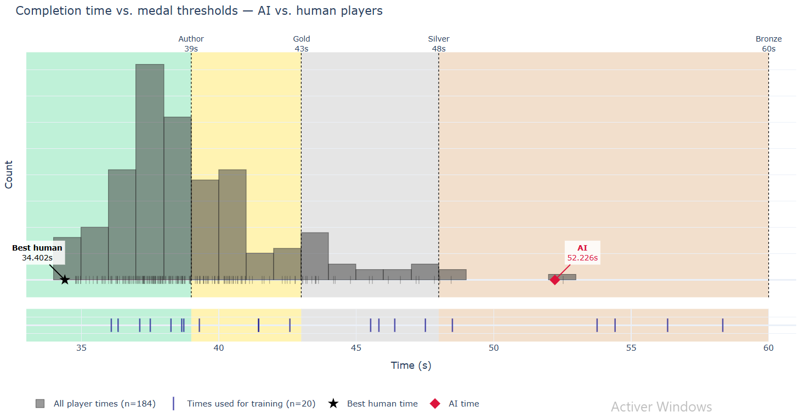
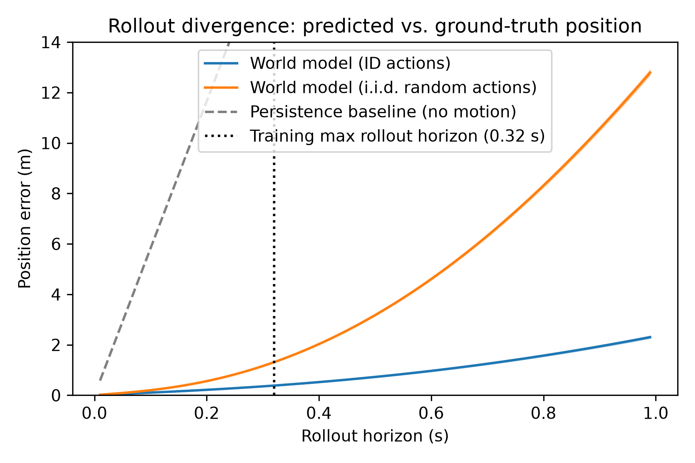
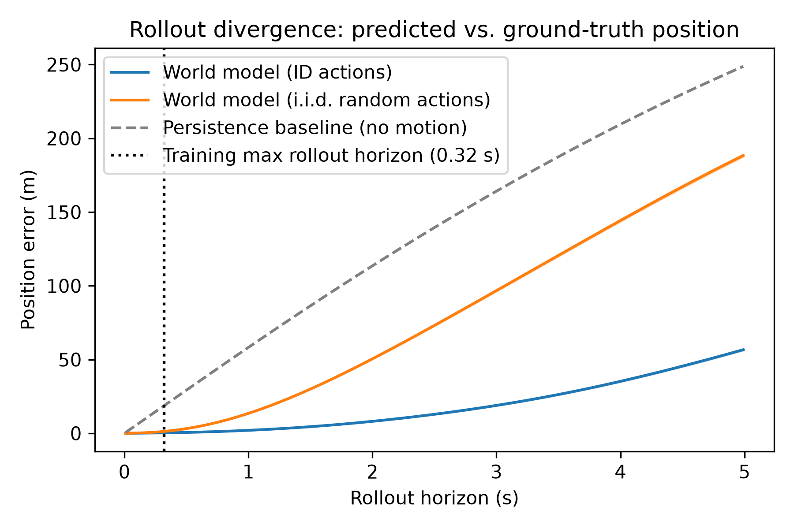

# A learned world model for TrackMania 2020

Toward cross-track generalization: an action-conditioned dynamics model trained on ~100 human replays, driven closed-loop by sampling-based planning, with no policy training and no per-map optimization, but with the route supplied.

https://github.com/user-attachments/assets/97723ca7-217a-4f6f-a700-96dd2bdcb8bd

## What this is, and what it isn't

Trackmania 2020 is a racing game in which players build and share tracks. A track is a start, a set/sequence of checkpoints, and a finish. Physics is deterministic and runs at a fixed 100 Hz tick; completion is verified exactly by the game. There are hundreds of thousands of community maps, each with author-assigned medals and human leaderboards.

Most published agents optimize one map. Linesight (TMNF) trains a CNN on greyscale frames and, after tens of hours on ESL-Hockolicious, reached a time that sat among the better human records on a heavily hunted map. Yosh (TMNF) trains per-map policies on a LIDAR-style range scan augmented with curvature lookahead, and got close enough that a professional caster with ten thousand hours in the game needed ten hours of dedicated attempts to beat one of the agent's runs, by 0.02 seconds, on a map the agent had trained on directly. TMRL (and follow-ups such as Neinders and AndrejGobeX) (TM2020) use screenshot CNNs or CV-extracted border distances; they drive a single track competently, usually well short of strong humans. That goal, grind one map toward a record, is legitimate, and those systems do it far better than anything here.

Generalization is rarer. PedroAI is the main published attempt: one DQN, cycled over hundreds of campaign maps, with screenshots plus kinematics and a reward against a human reference line. After 169 days it could finish 100 white/blue maps, with 11 author medals and 49 golds — but mean completion was still worse than bronze, and training had plateaued. Architectures like Linesight can be retrained on a new map; they do not, out of the box, play a new map.

This project targets the second objective, not the first:  **an agent that completes unseen tracks, adapting quickly rather than optimizing one map to a world record.**  The target is author-medal performance across a broad slice of the corpus. Sample-efficient generalization, not asymptotic per-map optimality.

The representation is a different bet as well. Linesight consumes pixels and must solve perception and control together. TMRL’s LIDAR setup collapses a frame to ~19 border distances — cheap and reactive, and mostly limited to flat roads with visible edges. Yosh is in the same family (range + some lookahead). Geometry-aware inputs already helped elsewhere: Neinders’ border curves and Sophy’s curvature lookahead beat purely reactive range-finding because the policy can plan past the next corner. We take that further and feed 3D geometry. That is privileged relative to a human (who only has vision); it does not put the agent “on the same tools” as a player. The hypothesis is that this is the right split anyway: drop the perception problem (a hard problem itself), keep surrounding context, and make the policy proactive rather than purely reactive, which should transfer more sample-efficiently than pixels or rays.

This is a personal research project, in progress. Phase 1, described below, is done and works. Phase 2 is not.

## The corpus, and why it is more than one task

Racing tracks are a significant part of the corpus and are a perfectly good problem in their own right. The difficulty is that an agent aiming at the corpus has to span categories whose hard part sits in very different places.

Alongside conventional tracks, the community has built whole categories that are closer to puzzles:

- **Altered Nadeo**: Nadeo publishes 25 official maps per seasonal campaign. Altered Nadeo tracks are community edits of those maps with one property changed, for example the same layout on ice, or driven with the rally car instead of stadium. 1-up and fewest-block (below) are subtypes of this broader category. Corresponding geometry, different dynamics, and the known line no longer applies.
- **1-up**: the finish sits one block higher than it should. Reaching it requires discovering that some surface, edge, or car behaviour can be abused for height.
- **Fewest-block**: an existing track with blocks iteratively removed until it is barely completable. The remaining geometry no longer describes a route; it has to be re-derived.
- **Multi-checkpoint routing**: several groups of checkpoints, where only one checkpoint per group has to be collected. The ordering is a combinatorial problem before it is a driving problem — a travelling salesman instance whose solution has to be realised as a continuous trajectory.
- **Trials and Kacky**: routes demanding precision, tricks, or game knowledge well beyond ordinary driving.
- **Towers**: tall/long checkpointless trial climbs where you start at the bottom, and need to reach the top.

Every one of these has the same formal structure — start, constrained checkpoint set, one of possibly several finishes, under fixed physics — but the difficulty sits in different places: combinatorial in one, control-precision in another, single-insight in a third; and sometimes several at once. In addition, the continuous-physics-with-discrete-checkpoints duality differentiate this testbed from other "puzzle-adjacent" like Sokoban or Baba Is You, where the state space is discrete throughout.

Current agents rely on progress being scorable as advancement along a known line (reward computed as progress along a human-recorded reference trajectory, and/or (Neinders) an explicit curve fit to the track borders to give the observation lookahead). On a 1-up or fewest-block track there is no such line, because finding the route _is_ the task. On a multi-checkpoint track the ordering has to be resolved before any line exists. Even on ordinary tracks the racing line is something to be found rather than given — e.g. inside for distance, outside for carried speed, and the trade depends on what follows.
Generalization across this corpus is therefore not "the same problem on new geometry."

### Why TrackMania is a good testbed for this

Deterministic physics at a fixed tick, so experiments are reproducible and rollout error is measurable against exact ground truth. Binary, server-verifiable success. Hundreds of thousands of human-authored tasks with metadata thanks to the TrackMania Exchange (TMX) platform. New tracks are published continuously, so held-out sets refresh themselves with novel human-designed content.

## Why a world model could transfer, when a per-map policy can't

The physics is identical on every track, while the geometry is not (including checkpoints).

A per-map RL policy entangles both in its weights: what the car does and what this particular track looks like are learned together, so a new track means relearning from scratch. Factorizing them separates the parts that transfer from the part that doesn't:

- a **dynamics model** — shared physics, in principle learned once;
- **geometry** — an input to that model, not something baked into weights;
- a **planner** — task-directed, and the natural place to express checkpoint constraints and puzzle structure.

This is the hypothesis behind the project: does factorizing into shared dynamics, geometry as input, and task-directed planning produce agents that solve unseen tracks — and which part binds first? It splits into two questions.

- Does a geometry-conditioned dynamics model stay accurate on geometry it was not trained on?
- Can a planner that is not hand-specified per track handle tasks whose difficulty structure varies — ordering constraints, precision, discovery — and satisfy completion constraints?

The second is the larger unknown. Phase 1 tests neither: it establishes only that the factorization closes the loop at all, on one track, with the route supplied.

## System

### State extraction

TrackMania 2020 has, to my knowledge, no prior work extracting 3D track geometry or internal physics the way this project does. Published TM2020 agents are still mostly a black box: TMRL is frames or CV-LIDAR in, virtual controller out. The exceptions are shallow telemetry, not a sim dump: PedroAI adds position and velocity to screenshots; Bluemax666 used screen plus speed. TMInterface (donadigo) focused on TrackMania Nations Forever — same engine lineage, but the physics was substantially reworked between them, so little transfers.

I reverse-engineered the game with Ghidra to locate the main loop, the relevant game mode, the physics and simulation step functions, input processing and its structures, and the collision map loader. Static analysis produced candidate addresses; I then wrote a memory-inspection tool with watchpoints, stepping, and field annotation to confirm or reject hypotheses dynamically and to discover further fields. This currently covers roughly 70 fields, not all confirmed.

For training on a simple map I kept only position, quaternion, velocity, and angular velocity, transformed into the car's local frame.

OpenPlanet plugins (e.g. XertroV's Record Raw Vehicle Data) can extract vehicle data, but OpenPlanet callbacks run at rendering frame rate, which is variable, rather than at the fixed 100 Hz physics rate. A hook at the simulation step gives clean, tick-aligned data instead.

*To protect Nadeo's IP and the game's integrity, this repository does not include internals, addresses, or the hooking library.*

### Dataset

I wrote a tool that replays stored replay files (which contain the input sequence) and extracts state at every physics step via the hook. Around 100 human replays of a single map were processed this way, yielding tick-aligned `(inputs, state)` trajectories at 100 Hz.

### Dynamics model

A GRUCell of roughly 460k parameters. Input at each step: action, physics state, and the local collision point cloud sampled around the car. Output: the physics state at the next tick. Trained with a curriculum on multi-step rollout, increasing the unrolled horizon up to K = 32 steps (0.32 s).

The collision geometry is currently represented as a point cloud; an SDF (signed distance field) representation is an alternative worth testing, because it has other pros and cons and it's not obvious whether it is better.

### Planning

Closed-loop control by sampling-based planning through the learned model — CEM and MPPI, scoring candidate action sequences by rolling them out under the model and evaluating them against a reward that follows a hand-specified track centerline.

The centerline is a honest weak point of phase 1 and is discussed under Limitations.

## Results

The agent completes the full track, driving entirely through planning over the learned model, with no policy training and no per-map optimization of any kind. The route, however, is supplied by the centerline. 

Completion time is around 52s, against an author medal of 39s and top human times near 34s. This is roughly beginner-level and is not competitive with per-map RL agents, which is expected and not the objective.

**Rollout divergence over horizon**, the plot of predicted-vs-true state error as a function of unrolled steps, is a measurement that characterizes the model's validity envelope, and it's the number that bounds how deep the planner can usefully search.

Mean position error grows from 0.0145m at K = 1 to 0.385m at K = 32 in a super-linear fashion. For scale, the car is about 2.1 m wide and 3.7 m long and the road roughly 15 m; at the planning horizon the error is 18.3% of car width, small enough that ranking candidate action sequences remains meaningful, which is what the planner needs.

## Limitations

- **One map.** No cross-map training and no cross-map evaluation. This means; 1 style, 1 geometry, only two surfaces (road and dirt), no behavioral modificator (like engine off or no steering), one car (stadium) out of the 4; out of a very rich set.
- **A hand-specified line.** Planning is guided by a hand-specified centerline reward. There is no policy training and no reward shaping during model training, but the *planner* is task-engineered, and a substantial part of "knowing where to go" is supplied rather than learned. Replacing it is the main phase-2 objective.
- **Times are slow.** Completion is around 52 seconds against an author medal of 39 seconds, and best times around 34 seconds.
- **No puzzle/hard tracks.** Everything above is a conventional racing track, and arguably a very simple one.

## Next steps and open questions

### Next steps

- Scale training across many maps and many more replays, and evaluate on held-out geometry. Starting first with 10 maps of the same style; then 100 maps but with multiple map styles etc.
- Represent checkpoint structure explicitly.
- Move from the hand-specified centerline objective toward a learned planner.
- Test SDF against point-cloud geometry representation.

### Broad open questions this testbed helps working on

- Compounding error, long horizon and temporal abstraction.
- Continuous physics, discrete checkpoints and constraint satisfaction.
- Meta learning, reasoning, uncertainty, hypothesis testing etc.

## Code

Code is in this repository. Game-internals findings and the hooking library are deliberately excluded.